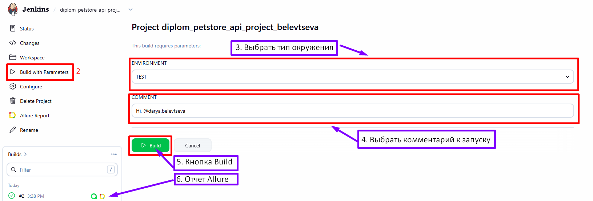
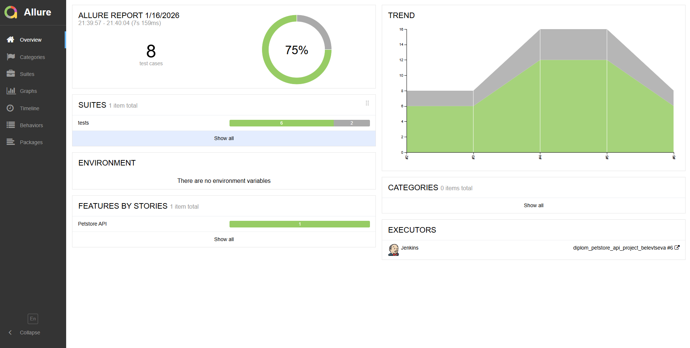
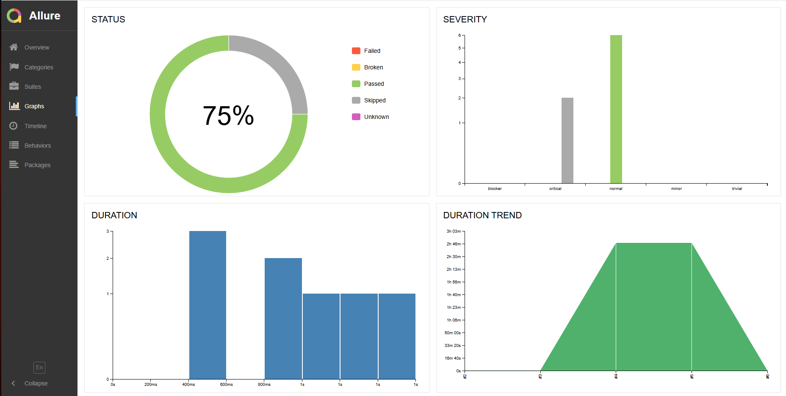
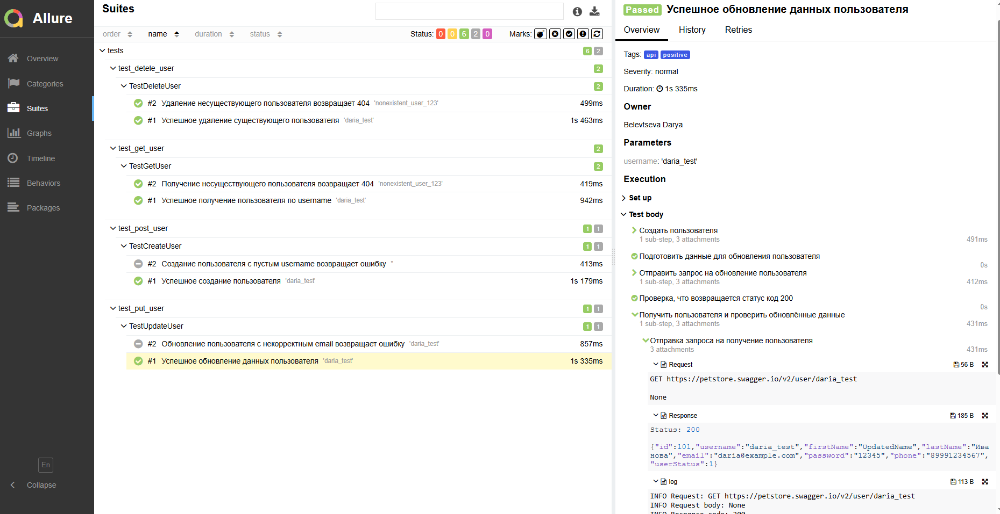
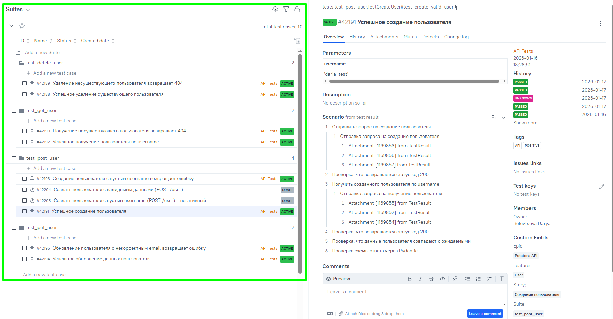
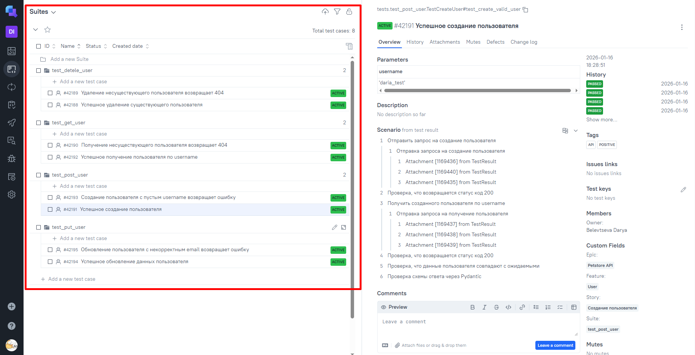
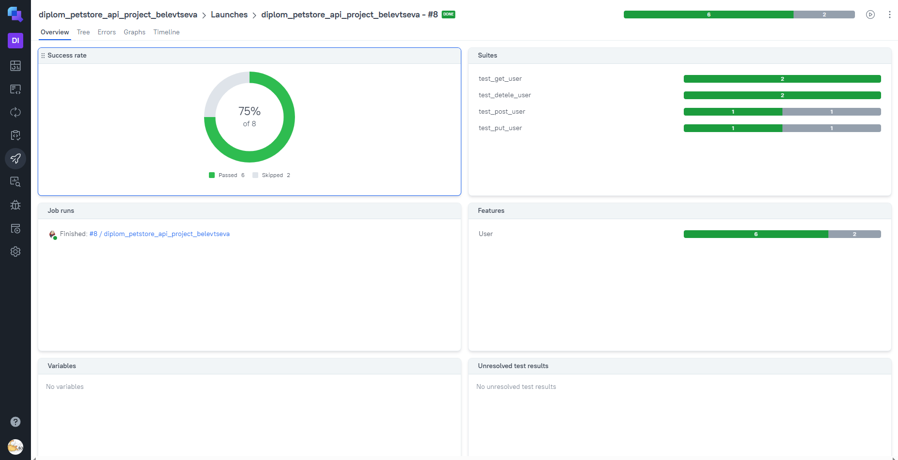
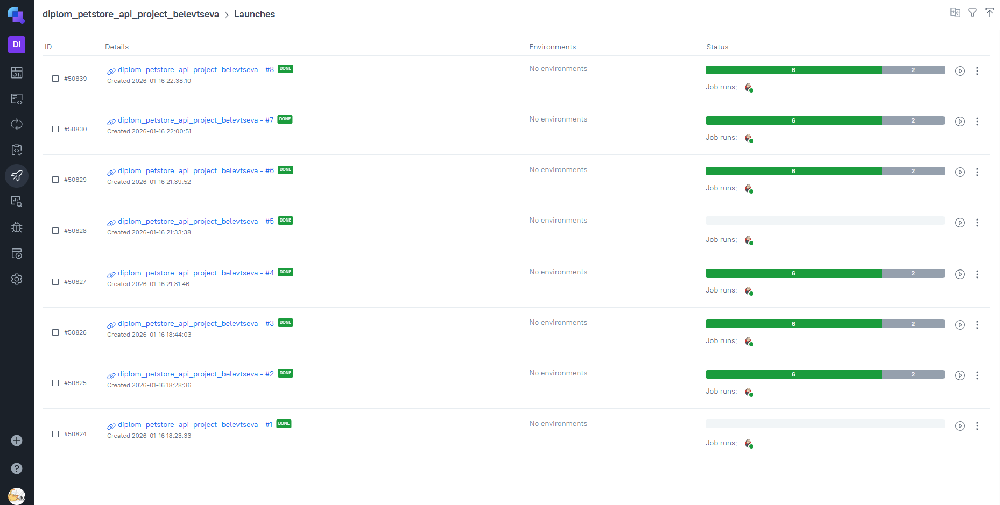
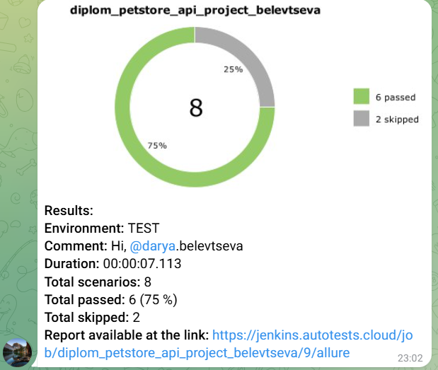

<h1> Проект по тестированию сервиса "API Petstore"

<a target="_blank" href="https://petstore.swagger.io/">Ссылка на "Petstore"</a>


## 📖 Содержание

- Описание проекта
- Что проверяется (API-тесты)
- Технологии и инструменты
- Запуск тестов
    - Jenkins
- Отчёты
    - Allure
    - Allure TestOps
    - Jira
- Оповещение о результатах прогона тестов в Telegram
- Пример видео прохождения API-автотестов

---

## ✅ Описание проекта

1. Данный проект посвящён автоматизации API-тестирования веб-приложения **Petstore (Swagger Petstore)**.
2. В рамках проекта реализованы API-автотесты для сущности `User`, покрывающие основные CRUD-операции.
3. Тесты написаны на Python с использованием `pytest` и `requests`.
4. Для валидации структуры ответов API применяются схемы на базе `Pydantic`.
5. Проект поддерживает параметризованный запуск автотестов через CI-систему Jenkins, а результаты выполнения тестов
   анализируются с помощью системы отчётности Allure.

---
<h3> Список проверок, реализованных в автотестах:</h3>

### API-тесты

✅ Создание пользователя (POST /user)

- Создание пользователя с валидными данными
- Проверка успешного создания пользователя
- Получение созданного пользователя и проверка данных
- Негативный тест: создание пользователя с пустым `username`

✅ Получение пользователя (GET /user/{username})

- Получение существующего пользователя по `username`
- Проверка корректности возвращаемых данных
- Валидация ответа с использованием Pydantic-схемы `User`
- Негативный тест: запрос несуществующего пользователя
- Проверка структуры ошибки через Pydantic-схему `ErrorResponse`

✅ Обновление пользователя (PUT /user/{username})

- Обновление данных существующего пользователя
- Проверка, что изменения успешно сохранены
- Валидация обновлённых данных
- Негативный тест: обновление пользователя с некорректным email

✅Удаление пользователя (DELETE /user/{username})

- Удаление существующего пользователя
- Проверка, что пользователь действительно удалён (GET возвращает 404)
- Негативный тест: удаление несуществующего пользователя

### Проект реализован с использованием:

<p>


<p>

- **Python** — язык программирования, на котором написаны UI-автотесты
- **Pytest** — фреймворк для организации и запуска тестовых сценариев
- **Selene** — фреймворк для UI-автотестирования на базе Selenium WebDriver
- **Selenoid** — инструмент для удалённого запуска браузеров в контейнерах
- **Jenkins** — CI-система для параметризованного запуска автотестов
- **Allure Report** — система формирования подробных отчётов о результатах тестирования
- **Allure TestOps** — платформа для управления тест-кейсами и аналитики прогонов
- **PyCharm** — среда разработки для написания и отладки автотестов
- **Jira** — система управления задачами и дефектами
- **Telegram** — канал для уведомлений о результатах выполнения тестов

---

###  Запуск проекта в Jenkins

### [Ссылка на сборку в Jenkins](https://jenkins.autotests.cloud/job/diplom_petstore_api_project_belevtseva/)

#### Для запуска автотестов в Jenkins

1. Открыть [Проект в Jenkins](https://jenkins.autotests.cloud/job/diplom_petstore_api_project_belevtseva/)
2. Выбрать пункт `Build with Parameters`
3. Выбрать тип окружения
4. Выбрать комментарий к запуску
5. Нажать кнопку `Build`
6. Результат запуска сборки можно посмотреть в отчёте Allure
   

---

###   Allure отчет

#### Формирование отчета:

- **локальный запуск**: ввести в командной строке```allure serve allure-results```
- **запуск через Jenkins**:  кликнуть кнопку ```Allure Report``` в боковом меню
#### Результаты запусков:



Отчет позволяет получить детальную информацию по все шагам тестов, включая скриншоты, log - файлы и видео о прохождение теста
(набор атач файлов зависит от типа тестов), а так же позволяет оперативно понять причину падения теста.
---
###  Интеграция с Allure TestOps

### [Ссылка на проект в Allure TestOps](https://allure.autotests.cloud/project/5082/dashboards)

#### Пример dashboard с общими результатами тестирования

#### Общий список всех тест-кейсов

#### Пример отчёта выполнения одного из автотестов

#### Пример dashboard с результатами запуска

#### История запуска тестовых наборов


---
###  Интеграция с Jira
### [Ссылка на проект в Jira](https://jira.autotests.cloud/browse/HOMEWORK-1567)


###  Оповещение о результатах прогона тестов в Telegram

